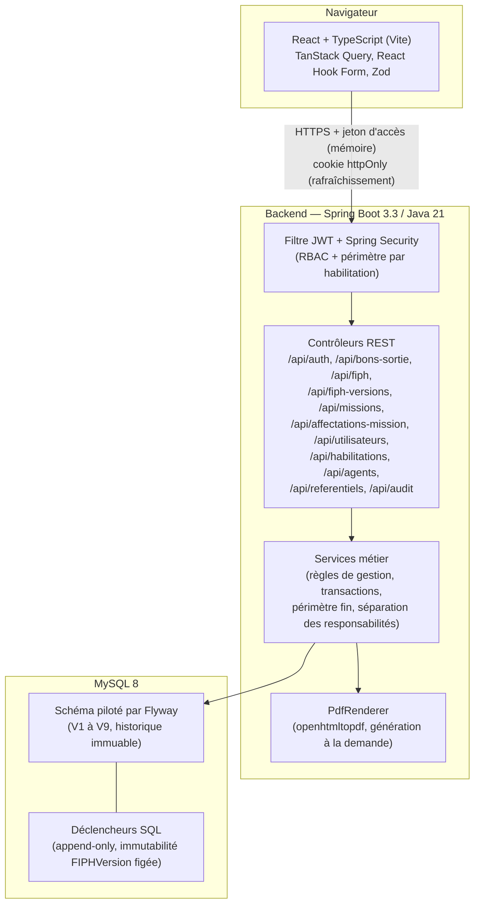

# Diagramme — Architecture générale

## Notes

- Le jeton d'accès (JWT, 15 min) est conservé uniquement en mémoire côté client — jamais dans `localStorage`. Le jeton de rafraîchissement (7 jours) est posé en cookie `httpOnly`/`Secure`/`SameSite=Strict`, restreint à `/api/auth`.
- Authentification simple depuis le 2026-08-17 (identifiant/e-mail + mot de passe, un seul appel — voir [analyse fonctionnelle §L](../01-analyse-fonctionnelle.md)).
- Aucune donnée n'est mise en cache côté serveur pour les documents PDF : chaque téléchargement régénère le document à la demande à partir de l'état persisté (section 13.5 du document source).
- Détail complet des paquets et des choix techniques : [02-architecture-technique.md](../02-architecture-technique.md).
