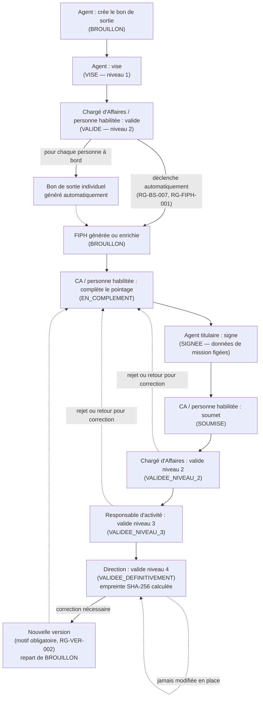

# Diagramme — Du bon de sortie à la FIPH validée définitivement

Parcours complet décrit section 12.2 du document source, tel qu'implémenté (et vérifié de bout en bout par `FiphWorkflowIT`).

## Règles clés illustrées

- **RG-HAB-004 (séparation des responsabilités)** : la personne qui a créé/complété une version ne peut jamais la valider, à aucun niveau — vérifié via le journal d'audit, pas par une simple case à cocher.
- **RG-VER-001 (immuabilité)** : une fois `VALIDEE_DEFINITIVEMENT`, la version est figée en base (déclencheur SQL en plus du contrôle applicatif) — toute correction passe exclusivement par une nouvelle version, jamais une modification en place.
- Le retour en arrière (rejet / retour pour correction) ramène toujours la version au statut `EN_COMPLEMENT`, jamais à `BROUILLON` — le pointage déjà saisi n'est pas perdu.
